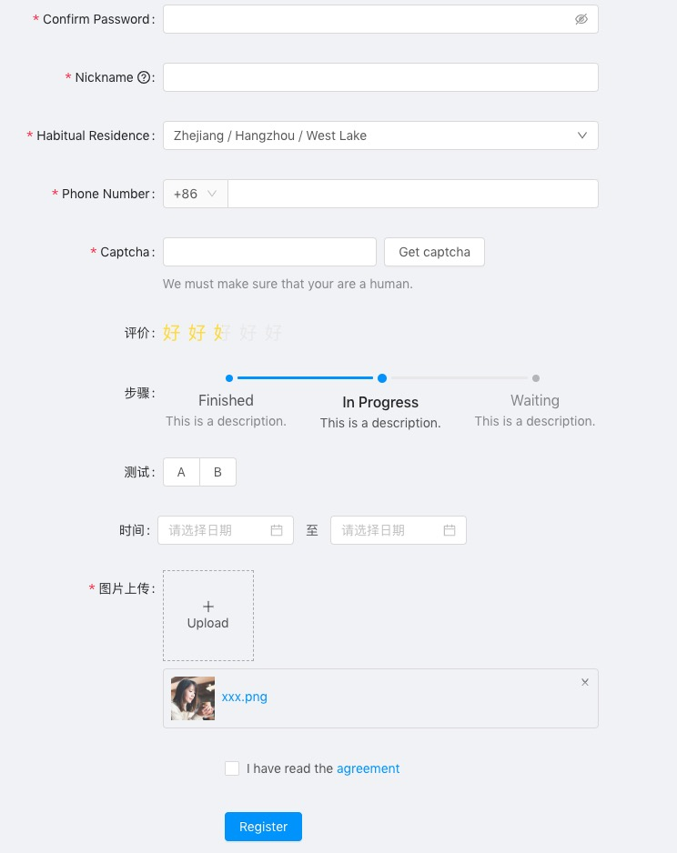

# Form

Form 是表单的构建器, 可以通过配置文件渲染出常见布局的表单, 完成常见表单的功能.
- 如表单1

- 如表单2


### 使用
```jsx
import {Form} from 'react-antd-super-form';
```

### 字段配置
```jsx
<Form 
  // 自定义 属性字段, 默认 vertical
  layout="'horizontal'|'vertical'|'inline'" 
  // Form 样式配置
  formLayout = {{}}
  // 组件配置
  data = {[]}
  // 复杂的组件配置, 可获取 表单 form 对象
  data = {form=>[]}
/>
```

### data 数组中 组件数据配置
```jsx
{
  // 组件是否渲染
  visible = true,

  // Form.Item 属性
  label,
  extra = null,
  hasFeedback = false,
  formItemLayout = {},

  // getFieldDecorator 参数
  unbind,
  key = `random_key_${Math.random()}`,
  config = {},  
  
  // 自定义组件渲染(即不包含在已有组件列表中)
  render,
  // 在一些特殊布局中使用
  renderFix,

  // button 是否绑定 搜索事件
  bindSearch = false,

  // 组件类型 "br|span|group|button|input|inputnumber|select|radio|radiobutton|slider|textarea|checkbox|datepicker|rangepicker|monthpicker|timepicker|switch|upload|cascader|steps"
  type, 
  // 组件固有属性
  ...props
}
```

### 案例
```jsx
<Form
  formLayout={{
    labelCol: {
      xs: { span: 24 },
      sm: { span: 8 },
    },
    wrapperCol: {
      xs: { span: 24 },
      sm: { span: 16 },
    },
  }}
  data={(form) => {
    const { getFieldDecorator } = form;
    return [
      {
        label: 'E-mail',
        type: 'input',
        key: 'email',
        config: {
          rules: [
            {
              type: 'email',
              message: 'The input is not valid E-mail!',
            },
            {
              required: true,
              message: 'Please input your E-mail!',
            },
          ],
        },
      },
      {
        label: 'Password',
        type: 'password',
        key: 'password',
        hasFeedback: true,
        config: (form) => {
          return {
            rules: [
              {
                required: true,
                message: '密码不能为空',
              }, {
                min: 4,
                message: '密码不能少于4个字符',
              }, {
                max: 6,
                message: '密码不能大于6个字符',
              },
              {
                validator: (rule, value, callback) => {
                  console.log(form)
                  if (value && this.state.confirmDirty) {
                    form.validateFields(['confirm'], { force: true });
                  }
                  callback();
                }
              },
            ],
          }

        },
      },
      {
        label: 'Confirm Password',
        type: 'password',
        key: 'confirm',
        hasFeedback: true,
        onBlur: (e) => {
          const { value } = e.target;
          this.setState({ confirmDirty: this.state.confirmDirty || !!value });
        },
        config: (form) => {
          return {
            rules: [
              {
                required: true,
                message: 'Please confirm your password!',
              },
              {
                validator: (rule, value, callback) => {
                  if (value && value !== form.getFieldValue('password')) {
                    callback('Two passwords that you enter is inconsistent!');
                  } else {
                    callback();
                  }
                },
              },
            ],
          }

        },
      },
      {
        label: <span>
          Nickname&nbsp;
    <Tooltip title="What do you want others to call you?">
            <Icon type="question-circle-o" />
          </Tooltip>
        </span>,
        type: 'input',
        key: 'nickname',
        config: {
          rules: [{
            required: true,
            message: 'Please input your nickname!',
            whitespace: true
          }],
        },
      },
      {
        label: 'Habitual Residence',
        key: 'residence',
        type: 'cascader',
        config: {
          initialValue: ['zhejiang', 'hangzhou', 'xihu'],
          rules: [
            { type: 'array', required: true, message: 'Please select your habitual residence!' },
          ],
        },
        options: [
          {
            value: 'zhejiang',
            label: 'Zhejiang',
            children: [
              {
                value: 'hangzhou',
                label: 'Hangzhou',
                children: [
                  {
                    value: 'xihu',
                    label: 'West Lake',
                  },
                ],
              },
            ],
          },
          {
            value: 'jiangsu',
            label: 'Jiangsu',
            children: [
              {
                value: 'nanjing',
                label: 'Nanjing',
                children: [
                  {
                    value: 'zhonghuamen',
                    label: 'Zhong Hua Men',
                  },
                ],
              },
            ],
          },
        ]
      },
      {
        label: 'Phone Number',
        type: 'input',
        key: 'phone',
        config: {
          rules: [{ required: true, message: 'Please input your phone number!' }],
        },
        addonBefore: getFieldDecorator('prefix', {
          initialValue: '86',
        })(
          <Select style={{ width: 70 }}>
            <Select.Option value="86">+86</Select.Option>
            <Select.Option value="87">+87</Select.Option>
          </Select>,
        )

      },
      {
        label: 'Captcha',
        key: 'captcha',
        type: 'input',
        config: {
          rules: [{
            required: true,
            message: 'Please input the captcha you got!'
          }],
        },
        extra: "We must make sure that your are a human.",
        renderFix: (item) => {
          return (<Row gutter={8}>
            <Col span={12}>
              {item}
            </Col>
            <Col span={12}>
              <Button>Get captcha</Button>
            </Col>
          </Row>)
        }
      },
      // {
      //   key: 'ke--',
      //   type: 'autocomplete',
      //   label: '自动完成',
      //   dataSource: [],
      //   style: { width: 200 },
      //   onSelect: () => { },
      //   onSearch: () => { },
      //   placeholder: "input here"
      // },
      {
        key: 'jj',
        type: 'rate',
        label: '评价',
        character: '好',
        allowHalf: true,
        config: {
          initialValue: 2.5
        }
      },
      {
        type: 'steps',
        label: '步骤',
        progressDot: true,
        current: 1,
        options: [
          {
            title: 'Finished',
            description: 'This is a description.'
          },
          {
            title: 'In Progress',
            description: 'This is a description.'
          },
          {
            title: 'Waiting',
            description: 'This is a description.'
          },
        ]
      },
      {
        type: 'radiobutton',
        label: '测试',
        key: 'aa',
        options: [
          {
            label: 'A',
            value: 1
          },
          {
            label: 'B',
            value: 2
          },
        ]
      },
      {
        label: '时间',
        type: 'group',
        unbind: true,
        formItemLayout: { style: { marginBottom: 0, width: 800 } },
        children: [
          {
            // label: 'Start',
            type: 'datepicker',
            key: 'startTime',
            validateStatus: "error",
            help: "Please select the correct date",
            formItemLayout: { style: { display: 'inline-block', width: 150 } },
          },
          {
            type: 'span',
            label: '至',
            style: {
              display: 'inline-block',
              width: 40,
              textAlign: 'center'
            }
          },
          {
            // label: 'End',
            type: 'datepicker',
            key: 'endTime',
            formItemLayout: { style: { display: 'inline-block', width: 150 } },
            onChange: () => {

            }
          },
        ]
      },
      {
        label: '图片上传',
        type: 'upload',
        key: 'searKey',
        listType: 'picture',
        config: {
          // initialValue: ['https://fanyi.bdstatic.com/static/translation/img/header/logo_40c4f13.svg'],
          initialValue: [
            {
              uid: '-1',
              name: 'xxx.png',
              status: 'done',
              url: 'https://zos.alipayobjects.com/rmsportal/jkjgkEfvpUPVyRjUImniVslZfWPnJuuZ.png',
              thumbUrl: 'https://zos.alipayobjects.com/rmsportal/jkjgkEfvpUPVyRjUImniVslZfWPnJuuZ.png',
            },
          ],
          valuePropName: "fileList",
          getValueFromEvent: e => {
            if (Array.isArray(e)) {
              return e;
            }
            return e && e.fileList;
          },
          rules: [{
            required: true,
            message: '请上传'
          }],
        },
        innerHTML: () => {
          return (<div style={{
            width: 100,
            height: 100,
            display: 'flex',
            flexDirection: 'column',
            justifyContent: 'center',
            alignItems: 'center',
            border: '1px dashed darkgray'
          }}>
            <Icon type={this.state.loading ? 'loading' : 'plus'} />
            <div className="ant-upload-text">Upload</div>
          </div>)
        }
      },
      {
        formItemLayout: {
          wrapperCol: {
            xs: {
              span: 24,
              offset: 0,
            },
            sm: {
              span: 16,
              offset: 8,
            },
          },
        },
        key: 'agreement',
        config: {
          valuePropName: 'checked',
        },
        type: 'checkbox',
        innerHTML: () => {
          return <span>I have read the <a href="">agreement</a></span>
        }
        // render: (form) => {
        //   return <Checkbox></Checkbox>
        // }
      },
      {
        formItemLayout: {
          wrapperCol: {
            xs: {
              span: 24,
              offset: 0,
            },
            sm: {
              span: 16,
              offset: 8,
            },
          },
        },
        // key: 'agreement',
        type: 'button',
        buttonType: 'primary',
        text: 'Register',
        onClick: () => {
          form.validateFields((errors, values) => {
            // ...
          });
          console.log(form.getFieldsValue())
        }
      },
    ]
  }
  }
/>
```